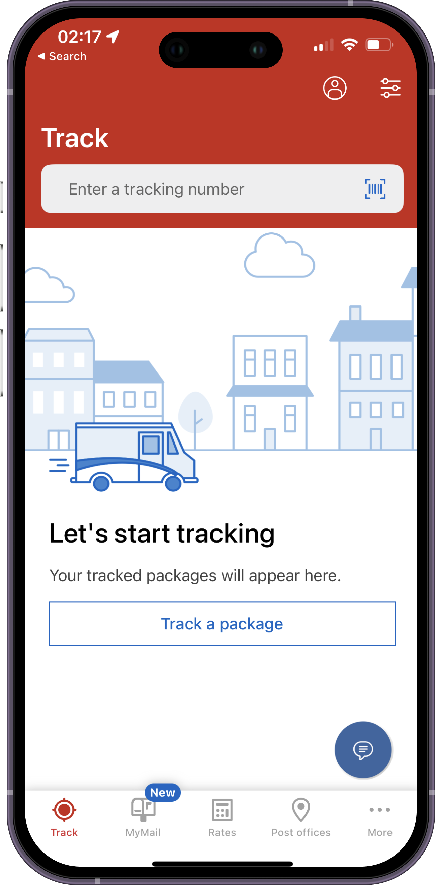
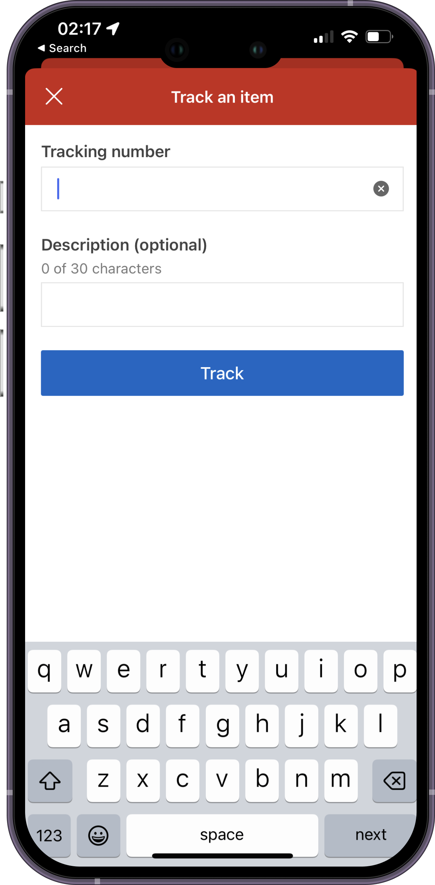
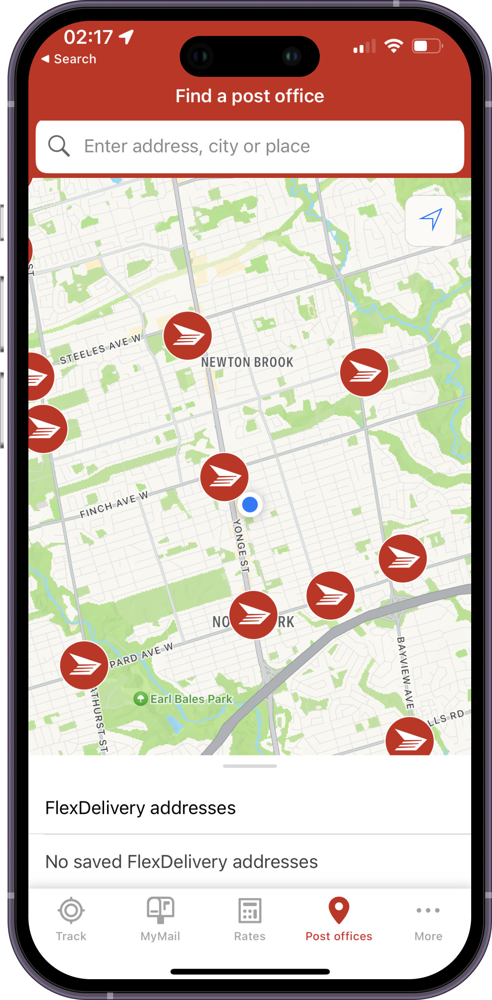
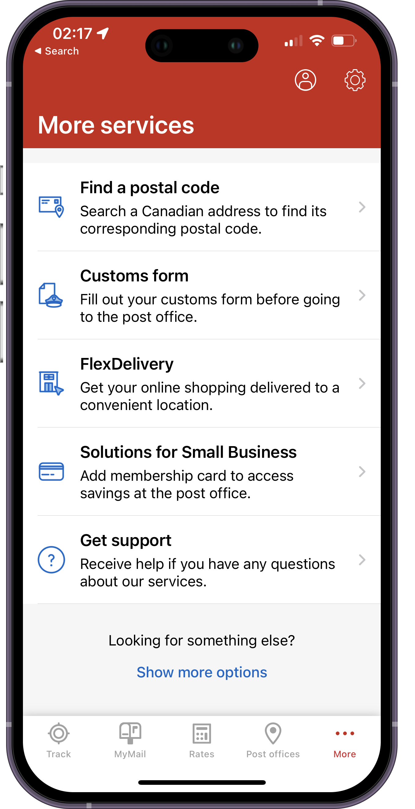

### Hi there 👋

Hi, I'm Billy Chan, a skilled iOS engineer living in Canada 🇨🇦 

Dedicated to crafting iOS applications with good user experience.

Here's my Linkedin: [billycychan](https://www.linkedin.com/in/billycychan/), feel free to send me a linkedin message!

### Portfolio 📂

#### BinTo: Waste Management Tool for Toronto  ♻️
"BinTo is your essential companion for eco-friendly living in the city. Seamlessly sort your waste with the Waste Wizard feature, ensuring you contribute to a cleaner environment. Stay informed about your next waste collection schedule effortlessly. Simplify your eco-conscious journey with BinTo."
- SwiftUI
- MapKit
- OpenData
- MV Pattern

    
    
    
    

 

 
 

#### TipTap: Quick Tip Calculator 🧾
[TipTap](https://apps.apple.com/us/app/tiptap-quick-tip-calculator/id6466767815): Your fast and easy tipping solution! Say goodbye to math hassles and hello to effortless tipping. Download now!

- SwiftUI
- AdMob
- App Store Deployment

    
    
    
    

 

 
 

#### GHFollowers 🫙

GHFollowers is an iOS app that allows a user to search for GitHub users, and browse their followers.

It was originally a [take home project](https://seanallen.teachable.com/p/take-home) from Sean Allen, I added additional features and refactored the project.  

- MVVMC + Combine
- Image Caching with NSCache for remote image
- Generic Network Layer for making network requests
- Swift Concurrency (async await) adoption

    
    
    
    

 

Special thanks to Sean Allen again for providing this free tutorial again.

 
 

#### Coinmama 💳
[Coinmama](https://www.coinmama.com/) is the leading cryptocurrency exchange platform to buy & sell crypto with credit card, debit card or bank transfer. It supports Tether (USDT), USD Coin (USDC), Bitcoin (BTC), and Ethereum (ETH).

- SwiftUI + Combine
- Analytic Service with Firebase and Appsflyer
- Unit test with XCTest
- QR Scanner for Wallet Connect
- Feature Flag with Firebase Remote Config

    
    
    
    

 

 
 

#### Canada Post 💌
The Canada Post app, available on the App Store, simplifies your postal experience. Track packages, find postal codes, and access convenient services like postage purchasing and mail redirection. Stay informed and manage your mail effortlessly with this user-friendly app from Canada's trusted postal service.

- Objective-C + Swift
- Accessibility with Voice Over
  

    
    
    
    

 

 
 

#### Lalamove 🚚

[Lalamove](https://www.lalamove.com/), the go-to app on the App Store, revolutionizes delivery and logistics. Instantly book on-demand delivery services, whether it's packages, documents, or larger items. Enjoy reliable, efficient, and cost-effective deliveries with a vast network of drivers. Simplify your logistics needs with Lalamove's user-friendly platform.

- Objective-C + Swift + VIPER
- Push Notification
- Deeplink Integration
- AB Testing Implementation
- Multi-language Localization with [Crowdin](https://crowdin.com/)
- Memory Leaks Fixes
- Network Module Refactoring with [Network Layer Demo](https://github.com/billycychan/ios-network-layer-demo) 
- Feature Flag System 
- App Store Deployment

    
    
    
    

 

 
 

#### SwiftUICrypto 🪙

[SwiftUICrypto](https://github.com/billycychan/SwiftUICrypto) is a cryptocurrency app that downloads live price data from an API and saves the current user's portfolio.

- SwiftUI
- Combine
- CoreData
- MVVM
- Animation
- GCD

    
    
    
    

 

Special thanks to Nick Sarno at [Swiftful Thinking](https://www.swiftful-thinking.com/) for providing this production quality [tutorial](https://www.youtube.com/playlist?list=PLwvDm4Vfkdphbc3bgy_LpLRQ9DDfFGcFu). 

 

#### Scrumdinger ⌛

Scrumdinger is an app that manages daily meetings.

- SwiftUI essentials
- Views
- Navigation and modal presentation
- Passing data
- State management
- Persistence and concurrency
- Drawing shapes with SwiftUI geometry tools
- Recording audio

    
    
    
    

 

Special thanks to Apple for providing this [iOS App Dev Tutorials](https://developer.apple.com/tutorials/app-dev-training). 

#### More
- [TwitterClone](https://github.com/billycychan/TwitterTutorial) 🤖
- [NetworkLayer](https://github.com/billycychan/ios-network-layer-demo) 🛜
- [GithubPlayground](https://github.com/bill0930/ios-GithubPlayground) 🛝
- [ObjectiveC-notes](https://github.com/bill0930/BNR-Objective-C-Programming) 📚